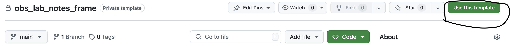
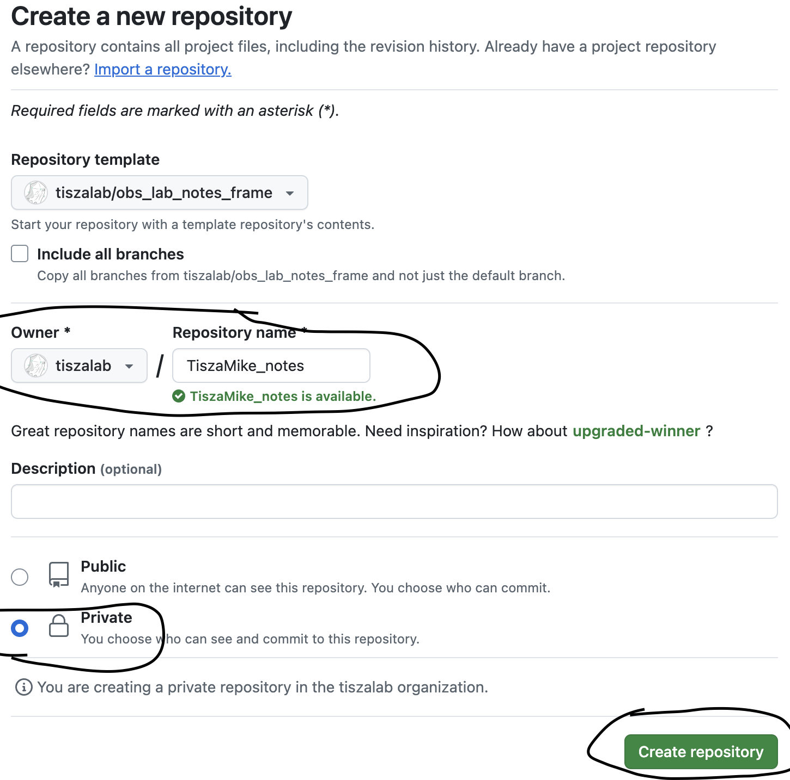
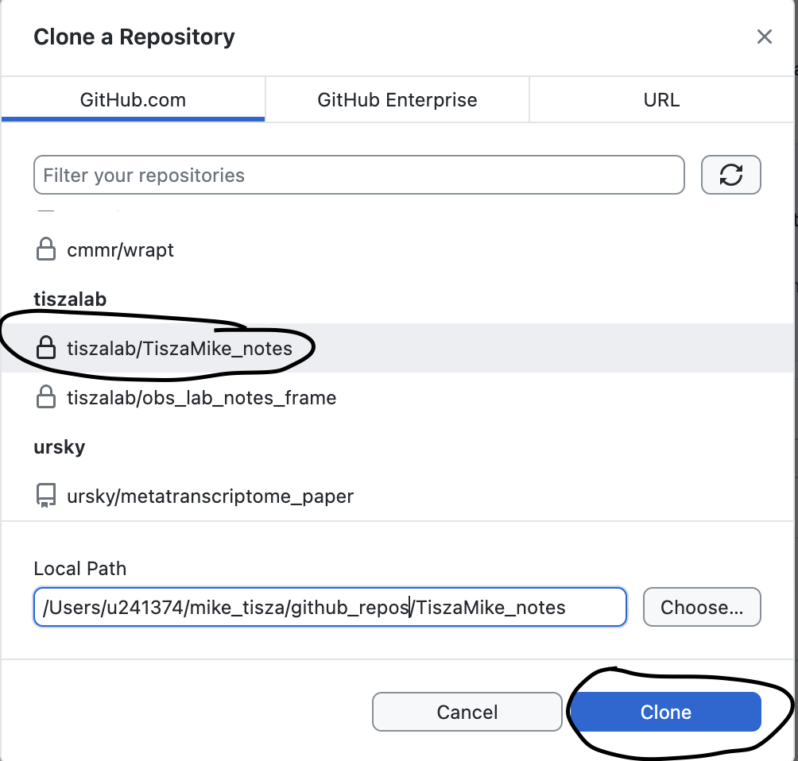
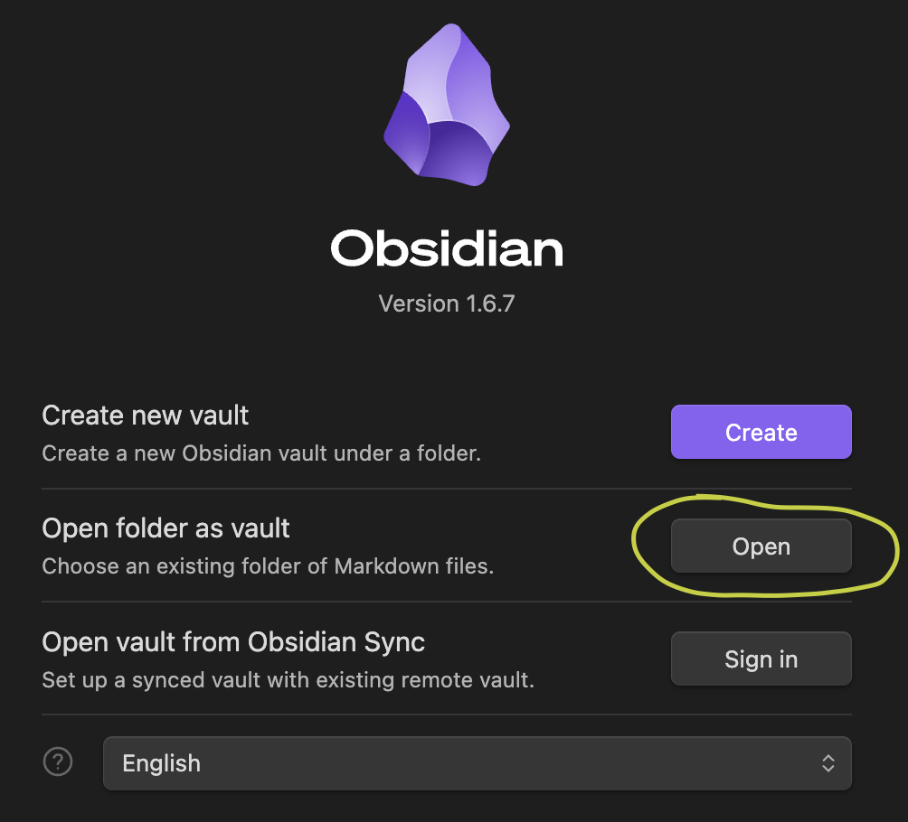
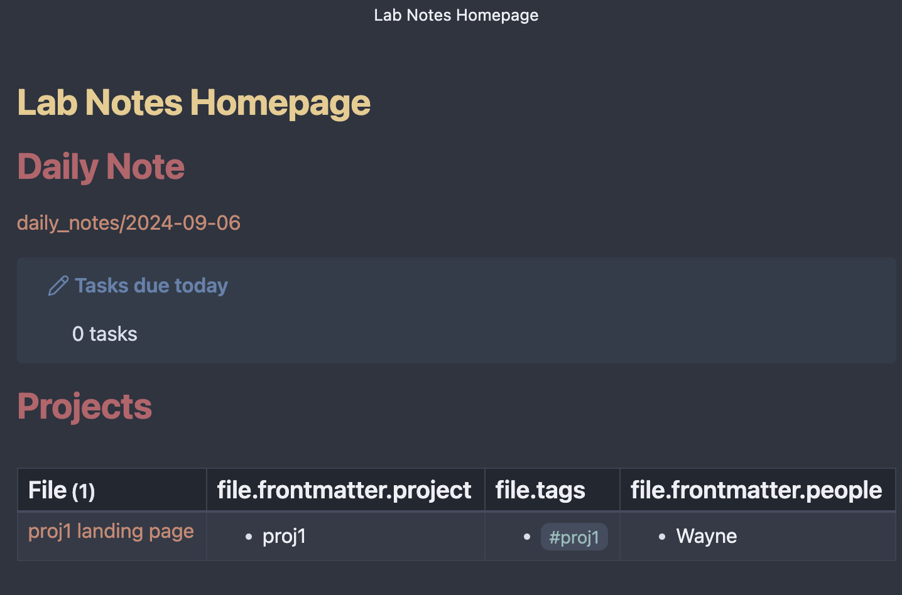
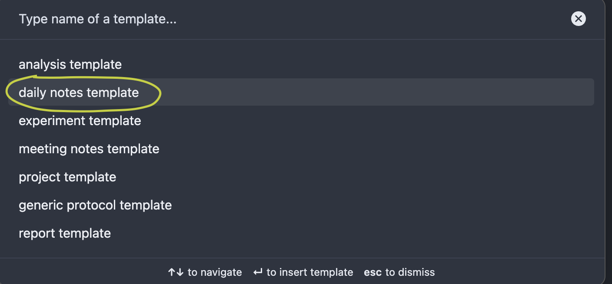
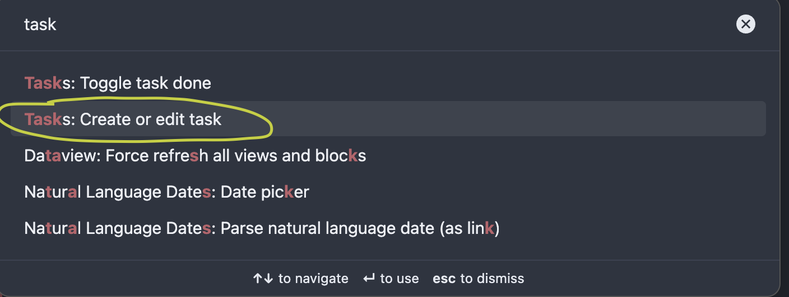
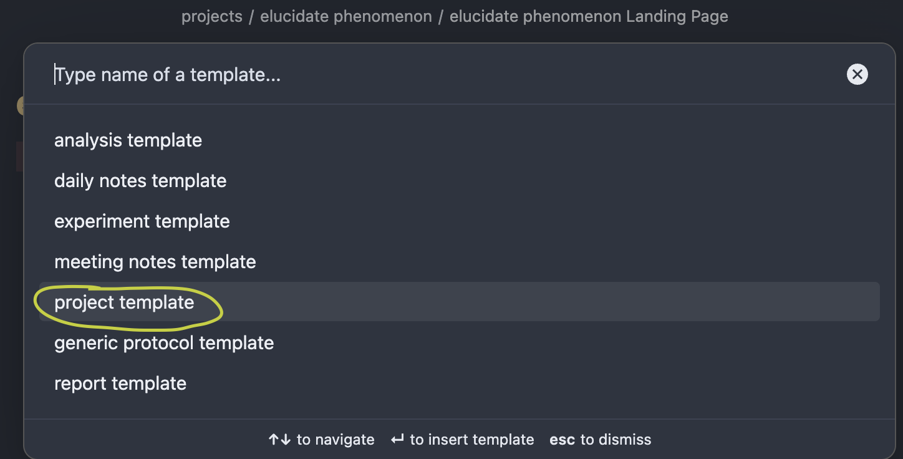
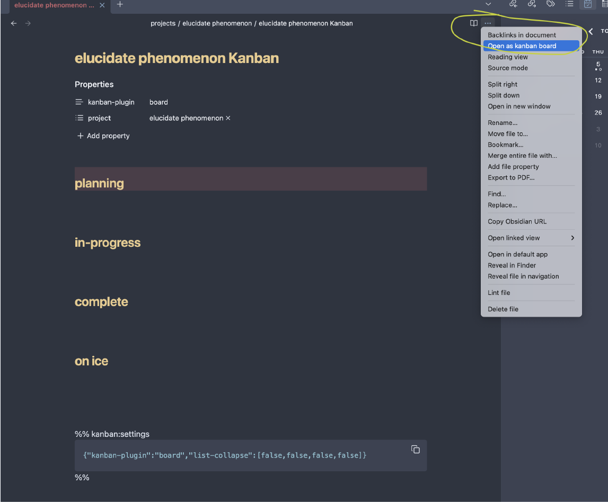

# tiszalab lab notebook framework

In the lab, we use `Obsidian` as our personal and team knowledge management system.

Each lab member needs a **Lab Notebook** which is an `Obsidian Vault` using custom templates and conventions to allow robust construction of a lab knowledge base.

I recommend keeping things fairly simple with regard to plugins so key information is in a human- and machine-readable format. This helps when people look back to your notes after you've left the lab.
# How-to

## Make your own lab notebook 

1) Prerequisites: 
	1) a `GitHub` account 
	2) (for Tisza Lab members) membership to the `tiszalab` GitHub organization
	3) `GitHub Desktop` installed
	4) `Obsidian` installed
2) On a web browser, "Use this template" to fork this repo, i.e. `tiszalab/obs_lab_notes_frame`

3) Make a new private repo within your lab's organization (`tiszalab` for Tisza Lab members) named `{Last}{First}_notes` where {Last} is your last name and {First} is your first name

4) On `GitHub Desktop`, go to the top menu, left side, click "Add" button, click "Clone Repository". Select the repo you just created and "Clone"

5) Open the `Obsidian` App. Then, open folder as vault, choosing the directory/repo you just cloned.

6) After "trusting" the document, you should arrive at your `Lab Notes Homepage`



## Key Plugins

Go to Settings -> Community Plugins. Search for plugins.

- [Tasks](https://github.com/obsidian-tasks-group/obsidian-tasks) <- Most essential plugin
- [Advanced Tables](https://github.com/tgrosinger/advanced-tables-obsidian)
- [Calendar](https://github.com/liamcain/obsidian-calendar-plugin)
- [Dataview](https://github.com/blacksmithgu/obsidian-dataview)
- [Homepage](https://github.com/mirnovov/obsidian-homepage)

## Nice-to-have Plugins

- [Charts](https://github.com/phibr0/obsidian-charts)
- [Contribution Graph](https://github.com/vran-dev/obsidian-contribution-graph)
- [Kanban](https://github.com/obsidian-community/obsidian-kanban)
- [Update modified date](https://github.com/alangrainger/obsidian-frontmatter-modified-date)

## Familiarize yourself with `Obsidian` lab note structure

To get a feel for `Obsidian` as a lab notebook, let's talk about some concepts: Properties, Document Types (`doc-type`),  Templates,  Links, and Tags.

* `Properties` are features that can be added to a `note`. These could be anything, but we want to use some standard things like `doc-type`, `date`, and `status`, to organize our notes, increase searchability, and "export our brain" to some extent. Properties are in `YAML` format and appear at the top of notes.

* `doc-types` include `analysis`, `experiment`, `project`, `kanban`, `meeting notes`, `project`, `report`, and `protocol`. Each time one of these notes is created, **import the appropriate template** (shown below) to add all the properties and sections it needs. Some templates, like `protocol` can be added within an `experiment` note.

* `Templates` are really just `note` objects, but they are barebones outlines, with appropriate properties and sections. They can be imported into regular `note` objects in your lab notebook. They must live in `templates/`

* `Links` can connect any notes together, just type [[note name]], "note name" between double square brackets

* `Tags` are just words with hashtags, e.g. #tiszalab that you can label notes, tasks, tables, etc. This can be a quick way to associate notes/projects/ideas.

* I find [this](https://obsidian.rocks/getting-started-with-obsidian-a-beginners-guide/) tutorial very useful for understanding `Obsidian` and markdown

1) From the `Lab Notes Homepage`, click the link `daily_notes/{YYYY-MM-DD}` to create a daily note. `daily note` is a lab-standardized `doc-type`, which means you should insert a `Template` for every instance (new lab note). This allows us to organize, search and understand all of the data we collect.

* Bring up the `Command Palette`, typing `command + p`, start typing "template", click "Templates: Insert template". Then find the **daily notes template**

2) You'll see you've added some properties and sections, like `To-Do` task list. Add a random task or two, make them due today

* Bring up the `Command Palette`, typing `command + p`, start typing "task", click "Tasks: Create or edit task".

* After creating a task, typing "Enter" will bring up a new task line below

* If you made a task with today as a due date, you'll see that "Tasks due this week" has now been populated.

3) Now create a new project (check out the fake `proj1` to see an example) by making a new directory within `projects/` directory called `{projectname}`. Then make a new `note` in this directory called `{projectname} Landing Page`. Import the `project template` and set up the project properties, etc.


4) **OPTIONAL** Make a Kanban board by creating a new `note` in the project directory, importing `kanban template`, updating the properties, and then clicking on the "three dots" in the top right corner and Open as kanban board.

* GitHub Projects are how the lab keeps track of all the experiments, chores, and miscellaneous action items of a project. 
* Some people find Kanban boards useful for their subproject personal planning


5) Make a new `experiment`, by creating a new directory `experiments/` within your project, and make a note there. Import `experiment template`, update the properties.  With your cursor in the **Actions** Section, import `generic protocol template`. Notice additional properties are also populated at the top.
6) At this point, you can probably delete the "fake" notes that came with this framework, like `proj1/` 

## Syncing/backing up notes

This system is not appropriate for "live" syncing or for multiple people co-editing a document in a vault simultaneously. The idea is to work locally and back up to `GitHub` frequently (at least **daily**)

1) Open `GitHub Desktop`, navigate to your notes' repo. Type a quick summary of your updated notes (a short sentence), then click "Commit to Main". That's it.

You can clone, update, change your vault on another computer the same way.

**Now you are on your way!**

## Other `Obsidian` tips and guidelines

Between [obsidian.rocks](https://obsidian.rocks/) and the Obsidian forum, you'll figure out most of what you need.  [this](https://obsidian.rocks/getting-started-with-obsidian-a-beginners-guide/) tutorial is great for markdown syntax. Here are some things I think may be useful. 

### Onboarding (for Tisza Lab members)
There is more information about electronic lab notebooks and notetaking in the private Tisza Lab Onboarding Document. Use `GitHub Desktop` to clone the repository [TiszaLab_Documents](https://github.com/tiszalab/TiszaLab_Documents/tree/main) from `tiszalab` and open this repo as an Obsidian Vault. the latest doc can be found in `onboarding/` 

### Directory structure

Try to create or move notes to a sensible directory (probably sorted by project).
Any new templates have to go in `templates/` or they won't be discoverable as templates.

Any random thoughts, notes, or documents that don't quite fit anywhere can go in `sandbox/`

Try to keep the base directory relatively clear.
### large files/images

This system is for notes, small/medium tables and images. This is not a data storage system. When in doubt, link a file from `OneDrive`/`DropBox`, etc.

Large files and images can be put in a `OneDrive` directory, then you can generate a link and paste it in your `note`

### coding projects
Bits and chunks of code/commands can and should be pasted into your notes. More fleshed out analyses, pipelines or tools should get their own `GitHub` repo, which can be linked to in your `notes`

### Copy-pasting
For almost everything, to paste, use 
`shift + command + v`


### Exporting notes to other formats

Use `Pandoc`. It should be installed just from the files in this repo/vault. If not, you can search on Community Plugins.

[pandoc installation troubleshooting](https://github.com/OliverBalfour/obsidian-pandoc/wiki/Installation)

Use the `Command Palette`, search "Pandoc",

### Importing .pdf or microsoft files (.docx, .pptx, etc) to markdown

Use the command line tool `markitdown` [here](https://github.com/microsoft/markitdown). Some manual post-conversion refiguring may be required.
### Preview
To preview another note, type: ![[]], with your note name inside the double brackets.

ex:
![[2024-09-05]]

You can preview just one section by appending "#" then the header name.

ex:
![[2024-09-05#To-Do]]
### functional code blocks for plugins

The plugins `Tasks`, `Dataview`, `query`, and `Charts` all bring functional code blocks, using triple back-ticks followed by the plugin name. These are like pseudocode allowing you to find/filter/display various objects in your vault.

Ex: using `datatable`

```dataview
LIST
from "templates/protocols"
```

This is something with a bit of a learning curve, so refer to the plugin online documentation. However, it can really improve the organization of ideas, so I recommend learning the basics.

### Example protocol

check out the example protocol [here](protocols/Reverse%20Transcriptase%20and%20PCR%20-%20Tiled%20Amplicon.md) to get a sense of how nice these can look. 

You can also add images and inline calculators if you wish.

### pretty code blocks

These don't run code but make code you write and paste in look nice

R
```R
sum_dt <- big_dt %>%
	group_by(species) %>%
	summarize(avg = mean(height),
	growl = "grrr")
```

Python
```python
def minimap2_sr(reference: str, read1: str, read2: 
                str, cpus: str):
    
    #raw_sam = open(rawsam_file, 'a')
    # First command-line
    mini2_command = ['minimap2', '-t', cpus, 
                    '-ax', 'sr', 
                    '--secondary=yes', 
                    '--sam-hit-only',
                    '-f', '100000',
                    '-N' '150',
                    '-p', '0.98',
                    reference, read1, read2]


    # Launch first process
    with subprocess.Popen(
        mini2_command,
        stdout=subprocess.PIPE,
        #stderr=STDOUT
        ) as mini2_proc:

        fd_child = mini2_proc.stdout.fileno()
    
    # read minimap2 output with pysam

        filter_records = []


        with pysam.AlignmentFile(fd_child, 'r') as ministream:
            for record in ministream:
                readLength: int=record.infer_read_length()
                alignLength: int=record.query_alignment_length
                # NM flag reports "edit distance" between read and ref
                try:
                    alignEdit: int=dict(record.get_tags(with_value_type=False)).get('NM')
                except:
                    alignEdit: int=0
                try:
                    alignProp: float=alignLength/readLength
                except:
                    alignProp: float=0

                try:
                    alignAcc: float=(alignLength-alignEdit)/alignLength
                except:
                    alignAcc: float=0
                if alignProp >= 0.9 and alignAcc >= 0.8 and alignLength >= 100: 
                    filter_records.append([
                        record.query_name,
                        record.reference_name,
                        readLength,
                        alignProp,
                        alignLength,
                        alignAcc
                        ]
                        )
        filter_df = pd.DataFrame(filter_records,
                                columns=['qname', 'rname', 
                                         'read_length', 'aln_prop', 
                                        'aln_len', 'aln_acc'])
    
    return filter_df
```

bash
```bash
for FROG in $LOG ; do echo $FROG ; done
```